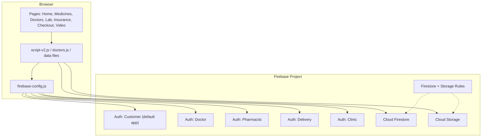
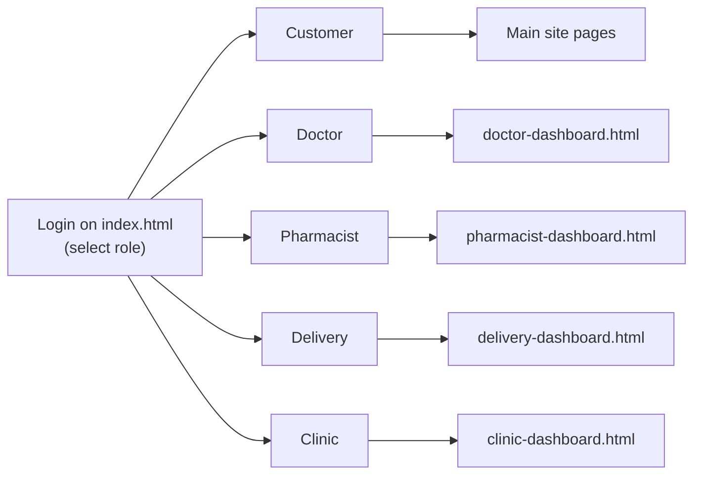
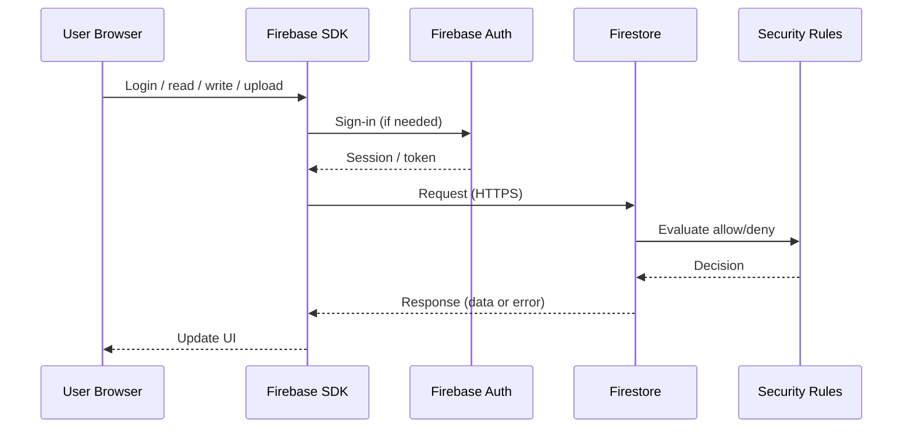

# Medify — System Architecture

This document describes how Medify is structured: frontend, Firebase backend services, multi-role authentication, data flow, and security.

---

## 1. High-level overview

Medify is a **static web application** (HTML / CSS / JavaScript) that uses **Google Firebase** as a Backend-as-a-Service (BaaS).

```
┌─────────────────────────────────────────────────────────────┐
│                     User's Browser (Client)                 │
│  HTML pages · CSS · Vanilla JS · Firebase Web SDK           │
└────────────────────────────┬────────────────────────────────┘
                             │ HTTPS (SDK requests / responses)
                             ▼
┌─────────────────────────────────────────────────────────────┐
│                 Google Firebase (Cloud)                     │
│  • Authentication  • Cloud Firestore  • Cloud Storage       │
│  • Security Rules (server-side enforcement)                 │
└─────────────────────────────────────────────────────────────┘
```

There is **no custom Node/Express server** in this version. Firebase provides auth, database, and file storage.

---

## 2. Architecture style

| Aspect | Choice |
|--------|--------|
| App type | Multi-page static website |
| Frontend | Client-side rendering (vanilla JS) |
| Backend | Firebase BaaS |
| Database | Firestore (NoSQL documents) |
| File storage | Firebase Cloud Storage |
| Auth model | Separate Firebase Auth apps per role |

---

## 3. Component diagram



---

## 4. Multi-role authentication (important)

Firebase Auth normally keeps **one user per browser app**.  
Medify initializes **named Firebase apps** so sessions do not overwrite each other:

| App name | Global auth object | Used by |
|----------|--------------------|---------|
| `(default)` | `firebaseAuth` | Customer (main site, checkout, notifications) |
| `doctor` | `firebaseDoctorAuth` | Doctor dashboard |
| `pharmacist` | `firebasePharmacistAuth` | Pharmacist dashboard |
| `delivery` | `firebaseDeliveryAuth` | Delivery dashboard |
| `clinic` | `firebaseClinicAuth` | Clinic dashboard |

Defined in `firebase-config.js`.

**Result:** Customer can stay logged in while a doctor or pharmacist logs in in another tab.

---

## 5. User roles and portals



---

## 6. Main feature flows

### 6.1 Pharmacy order
1. Browse medicines → add to cart (browser / session).
2. Checkout → authenticated customer creates document in `orders`.
3. Optional: upload prescription → file to Storage path `prescriptions/…` + metadata in `prescriptions`.
4. Pharmacist reviews / creates / dispenses order.
5. Delivery partner updates order status (out for delivery / delivered).

### 6.2 Doctor consultation
1. Patient selects specialty / doctor → creates `appointment_requests`.
2. Doctor accepts / rejects on dashboard.
3. On accept, notification may be written to `notifications` for the patient.
4. Video consult via `video-call.html`.

### 6.3 Lab booking
1. Patient books from lab pages → `lab_bookings`.
2. Clinic dashboard confirms / rejects.
3. Patient may receive notification updates.

### 6.4 Patient history (doctor / clinic)
1. Search / create records in `patients`.
2. Store vitals, visits, medications, lab arrays on patient documents.
3. Doctor dashboard also includes sample/demo patients for presentation.

---

## 7. Data model (Firestore)

Logical schema (NoSQL collections / documents):

```
users/{uid}
doctors/{doctorId}
appointment_requests/{requestId}
notifications/{notificationId}
orders/{orderId}
prescriptions/{prescriptionId}
lab_bookings/{bookingId}
patients/{patientId}
```

### Typical document fields (examples)

**orders**  
`items`, `total`, `address`, `phone`, `paymentMethod`, `status`, `customerId`, `customerEmail`, `createdAt`

**prescriptions**  
`customerId`, `customerEmail`, `fileUrl`, `fileName`, `status`, `createdAt`

**appointment_requests**  
`patientId`, `patientName`, `doctorEmail`, `doctorName`, `date`, `timeSlot`, `status`, `consultationFee`, …

**lab_bookings**  
`customerId`, `testName`, `preferredDate`, `timeSlot`, `status`, `createdAt`

**patients**  
`name`, `nameLower`, `dob`, `bloodGroup`, `lastVisit`, `vitals[]`, `visits[]`, `medications[]`, `lab[]`, `createdBy`

**Storage paths**
- `prescriptions/{fileName}`
- `signup_docs/{userId}/…`

---

## 8. Request / response model



Terms to remember:
- **Client** = browser  
- **Server** = Firebase cloud services  
- **Request / response** = SDK calls over HTTPS  
- **Authentication** = who you are  
- **Authorization** = what you may do (rules)

---

## 9. Security architecture

1. **HTTPS** encrypts traffic between browser and Firebase.
2. **Firebase Auth** issues session tokens after login.
3. **Firestore rules** (`firestore.rules`) and **Storage rules** (`storage.rules`) run on Firebase servers.
4. Client UI checks (e.g. allowed emails on dashboards) are for UX; **rules are the real gate**.

Example intent from rules:
- `users/{userId}` — only that user
- `doctors` — public read
- `appointment_requests` — patient / matching doctor email
- `orders`, `prescriptions`, `lab_bookings`, `patients` — authenticated access as configured

---

## 10. Frontend modules

| Module | Responsibility |
|--------|----------------|
| `index.html` + `script-v2.js` | Landing, login by role, cart hooks, notifications |
| `medicines.html` + `medicines-data.js` | Catalog / cart |
| `doctors.html` + `doctors.js` | Listing / filters |
| `labtest*.html` + `labtests-data.js` | Lab content / booking |
| `insurance.html` | Plans UI |
| `checkout.html` | Place order |
| `*-dashboard.html` | Role-specific operations |
| `firebase-config.js` | Multi-app Firebase init |
| `styles.css` | Shared UI |

Cart / checkout helpers may use **sessionStorage** for temporary cart data before writing to Firestore.

---

## 11. Deployment architecture

```
Developer machine
      │
      │ git push
      ▼
GitHub repository
      │
      │ deploy static files
      ▼
Static host (Firebase Hosting / Netlify / GitHub Pages / etc.)
      │
      │ browser loads site
      ▼
Firebase services (Auth / Firestore / Storage)
```

Deploy **Firestore** and **Storage** rules from the project when changing security.

---

## 12. Design principles used

- **Separation of concerns** — UI pages vs Firebase services vs rules  
- **Role isolation** — separate Auth apps for concurrent staff sessions  
- **Progressive enhancement** — static site works with CDN assets; cloud adds persistence  
- **Least privilege (intended)** — rules restrict reads/writes by auth and ownership where defined  

---

## 13. Limitations (current version)

- Not a full EHR / hospital HIS replacement  
- Payment gateway may be simulated / partial  
- Demo staff emails are allow-listed in dashboards for presentation  
- No custom Cloud Functions layer unless added later  

---

## 14. Related docs

- [README.md](./README.md) — features, setup, structure  
- `firestore.rules` / `storage.rules` — access control source  

---

**Medify architecture** — static frontend + Firebase BaaS + multi-role auth isolation.
